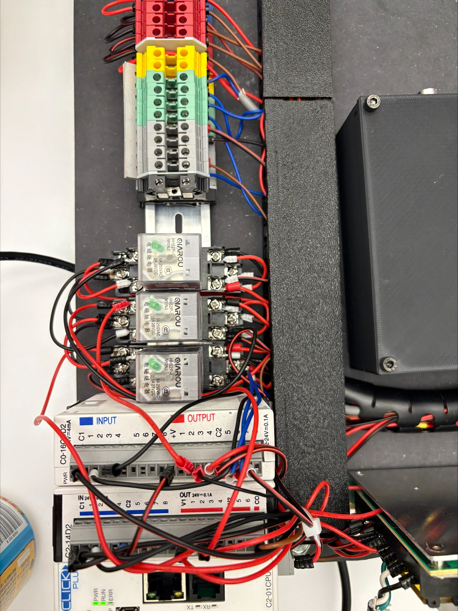
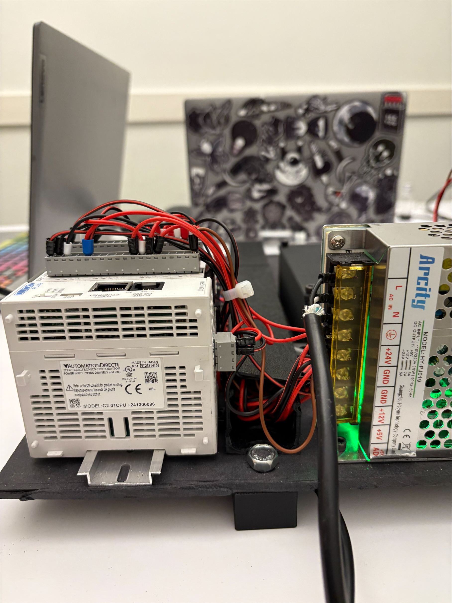
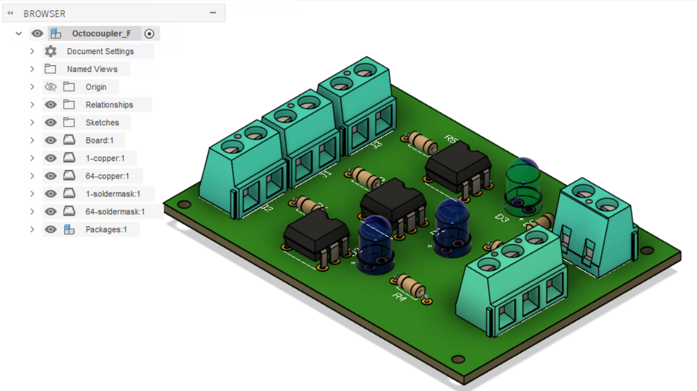

# Automated Filling, Capping & Sorting System

> Capstone Project — Seneca Polytechnic, Electromechanical Engineering Technology (Automation)


A fully integrated mechatronic system that automates a small-scale industrial packaging line: containers are detected, filled with liquid (black or white), capped, and sorted by color into separate chutes. A CLICK PLC drives the sequence; a Node-RED dashboard provides operator control and live monitoring over MQTT.

**Built by:** Harpreet Singh & Zahra Malekimoghadam
**Course:** TPJ653 — Capstone Project | **Instructor:** Iakov Romanovski

---

## Demo

[](https://youtu.be/HHJvgs4jYNk)

▶ **[Watch the full demo on YouTube](https://youtu.be/HHJvgs4jYNk)**

---

## System Overview

The system replicates an industrial packaging line on an educational scale, integrating mechanical design, electrical wiring, sensor integration, PLC programming, and IoT monitoring. A rotary indexing table moves containers between four stations: load, fill, cap, and sort.

### Process Sequence

```
   ┌──────────┐    ┌──────────┐    ┌──────────┐    ┌──────────┐    ┌──────────┐
   │  LOAD &  │ →  │   FILL   │ →  │  CAP &   │ →  │  COLOR   │ →  │   SORT   │
   │  DETECT  │    │  (pumps) │    │   GRIP   │    │  SENSE   │    │ (chutes) │
   └──────────┘    └──────────┘    └──────────┘    └──────────┘    └──────────┘
        │               │               │               │               │
   capacitive       2× peristaltic  linear actuator  through-beam   sorting slider
   sensor           pumps + timers  + bottom gripper color sensor   (electrical)
                    (T10/T11 ≈5.5s)  (T2/T3 ≈17s)
```

Cycle data (status, count, target quantity, color selection) is published over MQTT and rendered live on a Node-RED dashboard. The operator selects color and bottle quantity from the dashboard before starting a run.

---

## Tech Stack

| Layer | Technology |
| --- | --- |
| **Controller** | AutomationDirect CLICK PLC (C0-01CPU) — ladder logic |
| **HMI / IoT** | Node-RED dashboard, MQTT broker |
| **Sensors** | Capacitive proximity, inductive proximity, limit switches, color (through-beam) |
| **Actuators** | DC geared motor (rotary table), 2× peristaltic pumps, 2× linear actuators, sorting slider, gripper |
| **Power** | 24 V DC regulated supply, 5 A max — with E-stop and circuit protection |
| **Isolation** | Custom optocoupler PCB (4N35 with 2.2 kΩ current-limiting resistors) |
| **Mechanical** | MDF profile base frame, 3D-printed rotary table, custom container holders |

---

## Key Features

- **Operator-configurable runs** — color (black/white) and bottle quantity selectable from the Node-RED dashboard before each cycle
- **Sequence control** — sensor-triggered states with multiple ON-delay/OFF-delay timers (T2, T3, T5–T11) for filling, capping, and discharge
- **Live MQTT telemetry** — system status, cycle count, and customization values published to the dashboard in real time
- **Bottle counters** — CT2/CT3 compare current count against operator setpoint, auto-stopping at target quantity
- **Safety interlocks** — filling disabled when no container detected; emergency stop tested as part of regular maintenance
- **Modular wiring** — DIN-mount terminal blocks and relay bank for clean signal routing and easy swap-out

---

## Hardware Highlights

### Control Panel & Wiring

*Relay bank, terminal blocks, and CLICK PLC I/O modules wired on the back panel.*

### CLICK PLC + 24 V Power Supply

*AutomationDirect CLICK C0-01CPU paired with the 24 V DC regulated supply.*

### Custom Optocoupler PCB

*Custom-designed optocoupler isolation board (4N35, 2.2 kΩ series resistors) — designed in Fusion 360 / Eagle, replacing a more complex through-beam PCB after a cost-vs-value review.*

---

## Engineering Decisions & Iteration

This was an iterative project — several subsystems were redesigned mid-build after testing. The most significant pivots:

**Capping mechanism — press → screw + gripper.** The original press-cap design was unstable on small bottles; even minor misalignment caused caps to seat poorly. We switched to a screw-type capping system with a bottom gripper to hold the bottle steady, and moved to slightly larger bottles for reliability. Alignment is still being refined — see status badge above.

**PCB scope — custom through-beam → off-the-shelf sensor + custom optocoupler board.** A cost/component analysis showed a pre-built through-beam sensor was cheaper and more reliable than a custom sensor PCB. We pivoted the in-house PCB effort to an optocoupler isolation board for the 24 V PLC outputs — a smaller, more focused board with clear value (isolation between PLC and low-voltage control circuit).

**Mechanical prototyping.** Two full 3D-printed prototypes; the second resolved most clearance and fitment issues from the first. Final adjustments came after physical mounting revealed issues no CAD review caught.

**Dashboard scope.** Originally just status + count display. Added an operator customization section (color + quantity setpoint) once the team realized run setup was the real friction point in repeated cycles.

---

## I/O Map (selected)

| Tag | Function |
| --- | --- |
| X001 | Bottle entry / capacitive sensor |
| X002 | Color detection (through-beam) |
| Y001 | Gripper actuator |
| Y003 | Capping actuator |
| Y102 | Slider / sorting motor |
| Y104 | Capper motor |
| Y105 | Left peristaltic pump (color A) |
| Y106 | Right peristaltic pump (color B) |
| T2  | Gripper hold delay (~5 s) |
| T3  | Capping tightening delay (~17 s) |
| T7  | Discharge OFF-delay (~0.7 s) |
| T9  | Slider activation (~3.5 s) |
| T10 / T11 | Pump fill timers (~5.5 s each) |

Full I/O list and ladder logic are in the [Technical Report](#documentation).

---

## What I Learned

- **PLC ladder design under real timing constraints.** Tuning ON-delay vs. OFF-delay timers to handle physical actuator dynamics (e.g., capper torque, slider settling) is very different from textbook examples — every value came from instrumented testing.
- **MQTT + Node-RED is a high-leverage pattern.** A small amount of dashboard work made operator setup and live monitoring dramatically easier, and the same MQTT topics could feed a SCADA-style historian later.
- **Cost-driven design choices matter.** Choosing an off-the-shelf through-beam sensor over a custom PCB freed up time we used to actually finish capping and sorting. Knowing when *not* to design something is part of the job.
- **Mechanical reality lags CAD.** Two full prototype iterations and on-the-bench tweaks were needed; planning for that buffer would have eased the schedule.
- **Modularity pays off in commissioning.** Clean DIN-rail wiring and a documented I/O map made fault-finding much faster when sensors needed re-calibration.

---

## Roadmap

- [x] System block diagram, sequence design, hardware spec
- [x] CLICK PLC ladder logic — fill / cap / sort sequence
- [x] Node-RED dashboard with MQTT (status, count, color, quantity)
- [x] Optocoupler isolation PCB (designed, fabricated, integrated)
- [x] Rotary indexing table — DC motor + inductive feedback
- [x] Custom 3D-printed bottle holders + capping gripper
- [ ] **Capping alignment refinement** — final tuning of cap-to-bottle alignment for fully hands-off operation *(in progress — currently demo uses manual cap placement, screwing motion is automated)*
- [ ] Cycle-time monitoring on the dashboard
- [ ] Optional: SCADA-style historian over MQTT

---

## Documentation

- 📄 **[Technical Report (DOCX)](docs/Technical_Report.docx)** — Full system design, sequence, hardware specs, and BOM
- 📄 **[PLC Code (PDF)](docs/PLC_Code.pdf)** — Ladder logic for the full sequence
- 🎬 **Demo Video** — [YouTube](https://youtu.be/HHJvgs4jYNk)

---


This project was developed for academic credit at Seneca Polytechnic. Code and design files are shared for portfolio and educational reference. Reach out before reusing in commercial work.

📫 **Harpreet Singh** — [harpreetsingh.cloud](https://harpreetsingh.cloud) · [GitHub](https://github.com/harpreetsingh52004)
